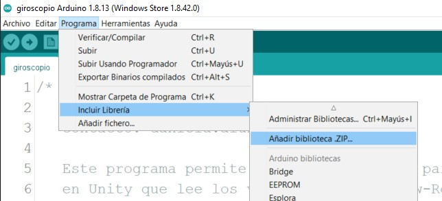
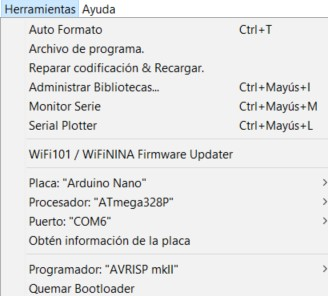
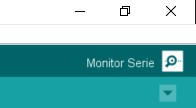
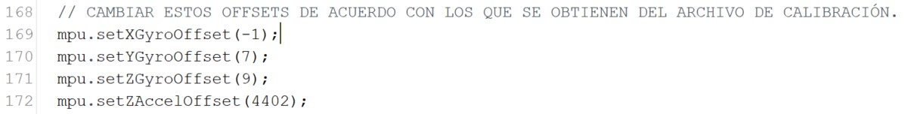

# SpaceExplorer
Proyecto de Unity en donde se pueden reproducir imágenes 360° y que permiten su navegación con la interacción de un Arduino Nano

## Instrucciones

Para poder usar el Aruino, revisar el ReadMe_conexiones.md para poder conectar los pines correctamente.

### Paso 1

Para poder utilizar el programa de Arduino, es necesario importar dos librerías al IDE de Arduino:

* I2Cdev
* MPU6050

Ambas librerías se pueden encontrar en el repositorio con carpetas con ese mismo nombre. 

### Paso 2

El diagrama eléctrico del Arduino es el siguiente:

### Paso 3

Primero se debe abrir el programa "calibracion.ino" y descargarlo en la placa Arduino.

**No hay que olvidar seleccionar el modelo de placa, en este proyecto se utilizó un Arduino Nano. Asimismo, no hay que olvidar seleccionar el puerto que detecte el IDE.**

Una vez que termine la descarga, abrir la ventana "Monitor Serie" el cual se encuentra hasta la esquina superior derecha.
Ya abierta, pedirá que se ingrese una letra para comenzar a calibrar. 
Queda esperar el tiempo que le tome al Arduino calcular los valores y al finalizar, es recomendable anotar los offsets en un arhivo de texto o en algún lado donde no se pierdan porque se van a utilizar en otro programa.

### Paso 4

Ahora hay que abrir el programa "giroscopio.ino" y colocar los valores de los offsets en las líneas 169, 170, 171 y 172 con los valores correspondientes. 
Finalmente se compila el pograma y se descarga a la placa. Se puede abrir el Monitor Serie para observar si los valores se están evíando correctamente.
Para saber si está bien calibrado el sensor, antes de mover la placa, los valores deben ser muy cercanos a 0.

### Paso 5

Posteriormente se debe de abrir el programa de Unity para poder ejecutar el programa. Algo importante es tomar en cuenta el puerto que la computadora detectó con el Arduino (eg. COM6).
Si se detecó con un puerto diferente, es necesario cambiar el códio fuente del archivo. 

Toda la información relacionada al programa de Unity, se encuentra en el ReadMe_Unity.md
