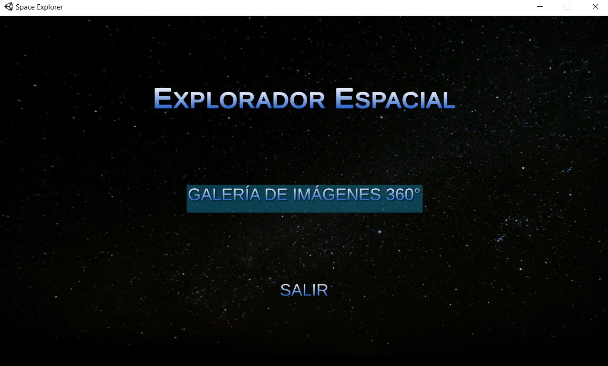
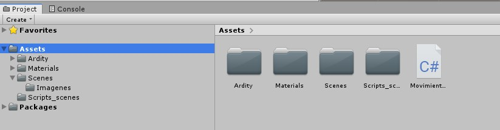
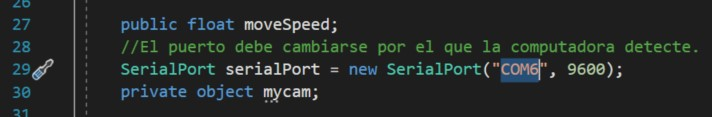
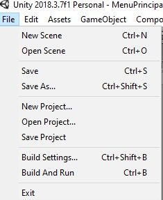
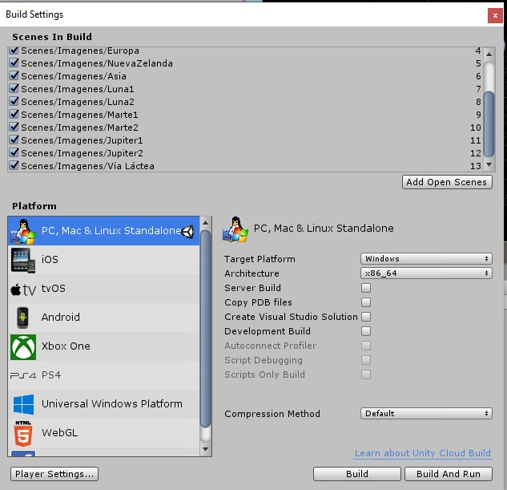
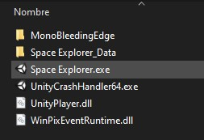

# README UNITY

Para el programa ejecutable de Unity se puede tener acceso dando [click aquí](https://drive.google.com/file/d/1_dnhDKaQiVDoQoGq-cODlQ8bwDvGuTB2/view?usp=sharing).
En caso de querer acceder al programa, más abajo viene el link de descarga.

## MENU

Al momento de abrir el archivo ejecutable, primero aparecerá una pequeña ventana para las dimensiones. Escoger la que se desee utilizar.

La ventana del menú principal es la siguiente

Al momento de dar clik en "Galería de imágenes" aparecerán varias miniaturas de las imagenes disponibles. Se puede navegar por las diferentes ventanas y escoger la deseada.

* Es necesario tener el arduino conectado a la computadora para poder moverse. Es necesario esperar unos pequeños segundos para que el programa empiece a tomar las lecturas. Después se puede presionar en continuar y comenzar a navegar la imagen con el arduino.

## Proyecto de Unity

Para modificar el puerto del arduino es necesario modificarlo desde el código fuente; por lo que el proyecto puede descargarse en en la [siguiente liga](https://drive.google.com/file/d/1hEpJFhs9MLMEnU6Fldu1nmrVaORFUYCu/view?usp=sharing).

Una vez exportada la carpeta es necesario abrira en Unity para poder acceder al código. Por lo que hay que dar click en el archivo e C# que está hasta la derecha.

Ya abierto el código, modificar la línea 29 y cambiar el nombre del puerto "COM6" por el que detectó la computadora.

Después de guardar el código, se puede exportar, para ello es necesario ir a la parte superior de la pantalla de Unity y dar click en File -> Build Settings

Finalmente, presionar en build para poder crear el ejecutable.

* Para abrir el ejecutable ir a la dirección donde se guardó la compilación y ejecutar el archivo .exe

