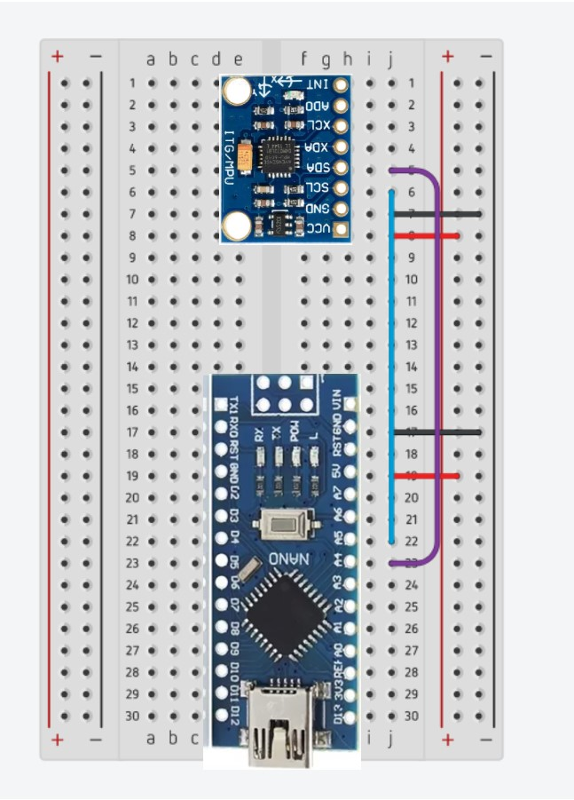
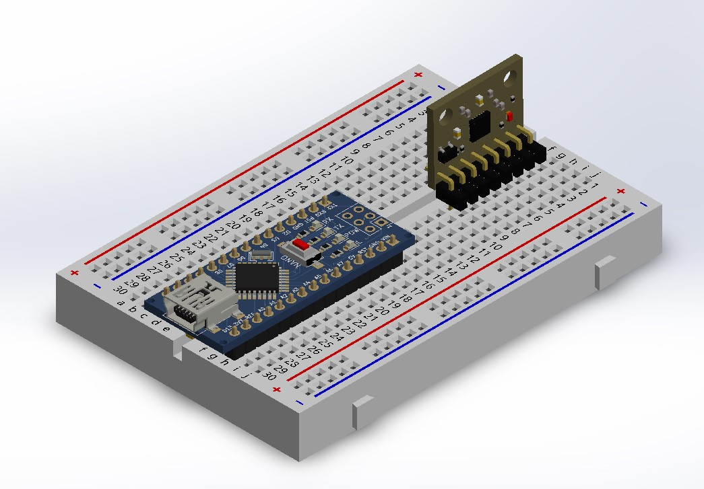
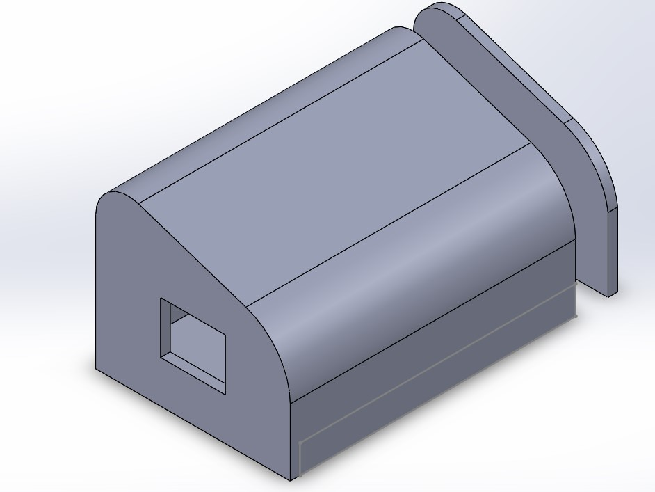
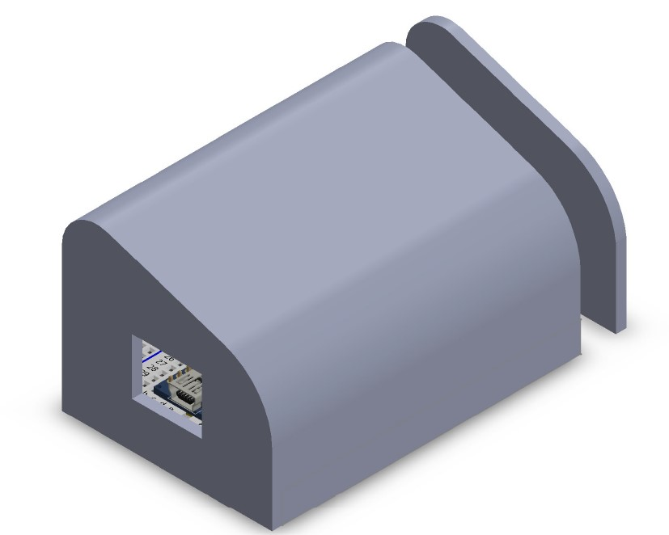
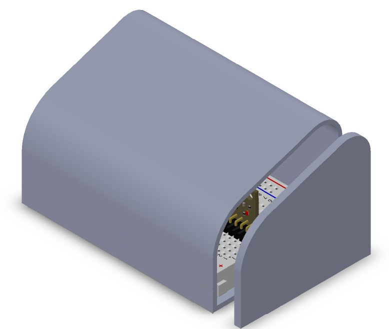

# README CONEXIONES

Para poder conectar el arduino correctamente, observar la siguiente imagen.

* 5V con Vcc
* GND con GND
* A4 con SCL
* A5 con SDA

Para saber cómo colocar el MPU6050 revisar la siguiente imagen.

## Carcasa

Para proteger el Arduino, el sensor y los cables que los conectan, se diseñó una carcasa simple y diseñada para que las posiciones de los dedos queden en buena posición.
Este carcasa se puede imprimir 3D, por lo que para descargar el modelo se puede dar [click aquí](https://drive.google.com/file/d/1dxy5iTUbo4509vFxXa3nKrjvEMsvTib2/view?usp=sharing)

